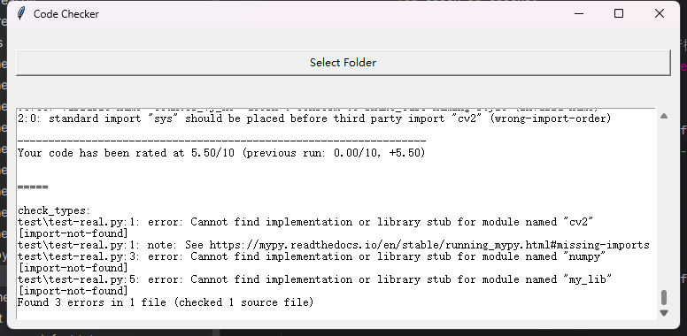

# Code Inspection
# Introduction
Ensuring code integrity and academic honesty is of paramount importance in the fields of academic computer science and software development. This study aims to combine the two functions of code plagiarism and defect detection by proposing an integrated tool that works together to detect the presence of academic plagiarism in code. The goal of the research is to develop a system that not only identifies possible plagiarism in code submissions but also detects programming defects, thus raising the bar for code quality and academic integrity.
The methodology used combines advanced algorithms in the field of plagiarism detection and software defect analysis. I used a hybrid approach that integrates string matching techniques for plagiarism detection and various static analyses to identify code anomalies. The tool was developed using Python and tested using a dataset containing various programming assignments.
The results show that the integrated tool significantly improves plagiarism and defect detection rates compared to using separate tools. The system was able to detect subtle similarities between code commits that are often missed by traditional plagiarism tools, and effectively identify critical defects that could lead to software execution failure.
In summary, the development of this integrated tool not only provides a powerful solution for the simultaneous detection of code plagiarism and defects, but also highlights the practical application of such integration in both educational and professional software development environments. The study confirms the feasibility and efficiency of combining these two aspects in a single tool, paving the way for more comprehensive software analysis techniques in the future.
## Features

## Code plagiarism detection
1. through string matching technology, it is currently possible to match similar sections present in two codes and to judge the existence of similar sections in two codes when the match exceeds a specified threshold value
2. For similar code segments, an analysis report will be provided to help you find duplicates in the code, providing a basis for you to further improve and edit the code.
3. Compare with the traditional matching tool, which requires a huge database. This code does not use the form of a database , you can only detect the existence of similar parts between the two code .
4. Detailed GUI reports can be generated to help developers improve code quality.
## Code defect detection:

1. There are many types of detection , you can comprehensively check the code for all kinds of defects , to find all kinds of problems in their own code .
2. real-time detection: high efficiency and speed, can quickly identify the existence of defects and errors
3. currently only supports python language
4. Intelligent repair suggestions: can effectively point out the problem and the detailed cause of the error, to help developers quickly solve the problem. 5.
5. can generate detailed GUI reports to help developers improve code quality .
6. can be used in conjunction with the first part of the code duplication detection to detect defects and errors in the code while finding code duplication problems, thus identifying the plagiarism part of the code. This is more conducive to the implementation of academic integrity.

# Usage:
1. Download the above file to the computer, open the file through the PyCharm, make sure the computer has python3.9. After that, run GUI.py directly.
2.you can see a directly generated interface, click to open the file, select the two copies of the code you want to detect
3. Wait 10 seconds, you can generate the results, and the results can generate a txt file to save in the folder.

# Installation: (as simple as possible)
## To download the file locally, you need to meet the following conditions to run:
1.Python3.9

2.pycharm
# Demonstrate results:
##You can see the two pictures below
Figure 1 is the normal code, through the detection can be learned in the checking test and the second part of the existence of similar content, in the defect detection, the code variable name is normal, the logic is clear and concise style. Got a score of 5

Figure 2 is a copy of the code that I assumed the existence of plagiarism by modifying it, and it can be learnt that there are similar contents with the normal code in the checking detection. In the defect detection, the variable names are too long and very complex, the logic is confusing, the structure is upside down, the style is also very redundant, and finally got 0 points.

Figure 3 shows the large number of problems that existed after the plagiarised code was detected (only a part of it was intercepted)
.png "Problems with Plagiarised Code")

It can be seen that if the code is written normally, through the defect detection can get a relatively good score, but the plagiarism of the code, will try to do everything possible to go with the source code of the differences between the variable names will be lengthened, inverted the order of the structure, to disrupt the original style. Although it can still run normally, but there is already a difference in logic with the source code, if you only use ordinary detection is unable to detect the problem, so through defect detection, we can clearly see the code with problems.
# Where the project still needs improvement:
1. When looking for files in the github public repository for experimentation, we found that some code itself has huge problems, which led to normal code also getting 0 points after defect detection
Solution: Modify the threshold and lower the requirements of the part to ensure that a basic score can be obtained

# Information currently being viewed:
https://github.com/blingenf/copydetect

https://github.com/dodona-edu/dolos

https://github.com/fyrestone/pycode_similar
# Check related papers：
References:
[1] Schleimer S, Wilkerson D S, Aiken A. Winnowing: local algorithms for document fingerprinting[C]//Proceedings of the 2003 ACM SIGMOD international conference on Management of data. 2003: 76-85.

[2] Chang, Hung-Fu, and Audris Mockus. "Evaluation of source code copy detection methods on freebsd." Proceedings of the 2008 international working            
conference on Mining software repositories. 2008.

[3] Roy, Chanchal K., James R. Cordy, and Rainer Koschke. "Comparison and evaluation of code clone detection techniques and tools: A qualitative   
approach." Science of computer programming 74.7 (2009): 470-495.
